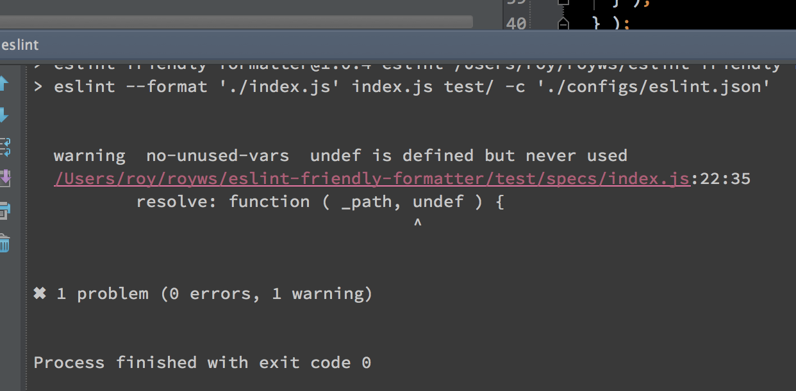

# [eslint](https://github.com/nzakas/eslint/)-friendly-formatter
> A simple formatter/reporter for [ESLint](https://github.com/nzakas/eslint/) that's friendly with Sublime Text and iterm2 "click to open file" functionality

[](https://npmjs.org/package/eslint-friendly-formatter)
[](https://travis-ci.org/royriojas/eslint-friendly-formatter)

## Motivation for this module

I decided to use [eslint](https://github.com/nzakas/eslint/) to verify my code and sadly the reporter was not terminal
friendly. Basically I cannot click on the file to open it with my text editor and go directly to the line where
the error was reported. This module fixes that issue, by using the syntax that "sublime text" introduced to open files.

> Filenames may be given a :line or :line:column suffix to open at a specific
> location.

This module is based on the original `stylish` formatter that is now part of ESLint, it adds the following

- All the errors are reported at the end, so no more search for errors between tons of report lines
- RuleIds are clickable on terminals like iTerm2 and take you to the ruleId documentation site.
- A summary is shown at the end with the offended ruleIds, ruleIds are also clickable.
- It also shows a bit of context where the error happened, Making easier to understand the nature of the error
- If you use [iTerm2](http://iterm2.com/) or [Guake](http://guake-project.org/)\* the link for the file becomes clickable **and will open your editor at the given line**.
  Please make sure you have properly configured the option to open uris that matches files with your editor of choice.
  Sublime is a great choice!, but this should work as well with other editors that understand the pattern used by sublime

  \* Note: Until Guake v0.7.3 is released, it may be necessary to compile master from source.

## Example of the output


## install

```bash
npm i --save-dev eslint-friendly-formatter
```

## Intellij/Webstorm/PhpStorm integration
0. Install `eslint` and `eslint-friendly-formatter`.

   ```bash
   npm i -D eslint eslint-friendly-formatter
   ```

1. Add a script to your package json like:

   ```javascript
   {
     "scripts": {
       "eslint": "eslint --format 'node_modules/eslint-friendly-formatter' file1 file2 dir1/ dir2/",
     }
   }
   ```

1. Create a external tool to run eslint using this module as your formatter like this
   - program: `npm`
   - parameters: `run eslint`
   - working directory: `$ProjectFileDir$`

2. Use an output filter like: (Please note the 2 spaces before `$FILE_PATH$`)

   ```bash
     $FILE_PATH$.*:$LINE$.*:$COLUMN$
   ```
3. When launching the tool now the files will be also clickable, see:
   

## Usage

In the command line

```bash
# just make sure you pass the path to the module to the format option of eslint
eslint.js --format './node_modules/eslint-friendly-formatter/index.js' index.js test/ -c './eslint.json'
```

Or as a module

```javascript
var eslint = require('eslint');
var opts = readJson('./path/to/options');

var engine = new eslint.CLIEngine( opts );
var report = engine.executeOnFiles( ['file1.js', 'file2.js'/*, ...*/] );
var results = report.results || [];

var formatter = require('eslint-friendly-formatter');
var output = formatter(results);

// this will print the report if any...
console.log(output);

```
It works with `gulp` and `gulp-eslint`

```javascript
var friendlyFormatter = require("eslint-friendly-formatter");
// Your js task
gulp.task("javascript", function() {
  return gulp.src(["src/js/**/*.js"])
    // Your eslint pipe
    .pipe(eslint(".eslintrc"))
    .pipe(eslint.format(friendlyFormatter))
    // Continue your other tasks
    .pipe(concat("app.js"))
    .pipe(gulp.dest("dist/js"))
});
```

It should work well in with eslint-grunt or grunt-eslint

```javascript
grunt.initConfig({
    // when using eslint-grunt:
    eslint: {
        options: {
            formatter: './node_modules/eslint-friendly-formatter'
        }),
        target1: {
            //..
        }
    },
    // when using grunt-eslint:
    eslint: {
        options: {
            format: './node_modules/eslint-friendly-formatter'
        }),
        target2: {
            //..
        }
    }
});
```
## Formatter parameters

Eslint does [not support passing parameters to formatters from the cli](https://github.com/eslint/eslint/issues/2989) yet. So in order
to pass parameters to the formatter we will have to rely on **environment variables**

### EFF_NO_GRAY

Disable the gray color output

We use the gray color to show some info about the context where the error/warning happens. If for some reason you want to disable the gray color, [in cases like this one ](https://github.com/royriojas/eslint-friendly-formatter/pull/2), you can do it using an environment variable.

```bash
export EFF_NO_GRAY=true
```

And the gray color won't be used.

### EFF_ABSOLUTE_PATHS

Make the paths of the files in the reporter be absolute instead of relative as it is by default in the received results.

Some terminals work better with relative paths (like `iTerm2` with `fish`) and other dislike it like `Guake`. So starting in version v.1.1.0 the paths will be relative by deafult. If you need the absolute please export the following variable

```bash
export EFF_ABSOLUTE_PATHS=true
```

### EFF_EDITOR_SCHEME

If this parameter is set, a url will be output below the filename.

Some terminals only support clicking on urls, and editors can be configured to respond to custom url schemes.

```bash
export EFF_EDITOR_SCHEME=editor://open?file={file}&line={line}&column={column}
```

## [Changelog](./changelog.md)

## License

MIT


