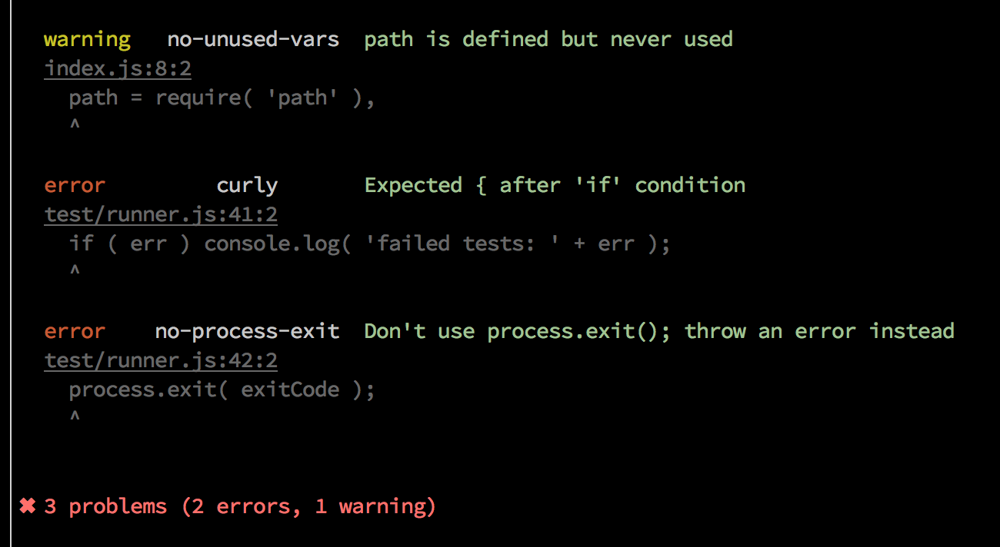
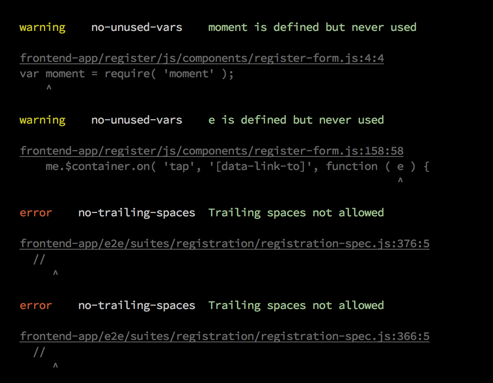

# [eslint](https://github.com/nzakas/eslint/)-friendly-formatter
> A simple formatter/reporter for [ESLint](https://github.com/nzakas/eslint/) that's friendly with Sublime Text and iterm2 "click to open file" functionality

[](https://npmjs.org/package/eslint-friendly-formatter)
[](https://travis-ci.org/royriojas/eslint-friendly-formatter)

## Motivation for this module

I decided to use [eslint](https://github.com/nzakas/eslint/) to verify my code and sadly the reporter was not terminal 
friendly. Basically I cannot click on the file to open it with my text editor and go directly to the line where 
the error was reported. This module fixes that issue, by using the syntax that "sublime text" introduced to open files.

> Filenames may be given a :line or :line:column suffix to open at a specific
> location.

This module is based on the original `stylish` formatter that is now part of ESLint, it adds the following

- All the errors are reported at the end, so no more search for errors between tons of report lines
- It also shows a bit of context where the error happened, Making easier to understand the nature of the error
- If you use [iTerm2](http://iterm2.com/) the link for the file becomes clickable **and will open your editor at the given line**. 
  Please make sure you have properly configured the option to open uris that matches files with your editor of choice. 
  Sublime is a great choice!, but this should work as well with other editors that understand the pattern used by sublime 

## Example of the output

- Example 1
  

- Example 2
  

## install

```bash
npm i --save eslint-friendly-formatter
```

## Usage

In the command line

```bash
# just make sure you pass the path to the module to the format option of eslint
eslint.js --format './node_modules/eslint-friendly-formattter/index.js' index.js test/ -c './eslint.json'
```
Or as a module

```javascript
var eslint = require('eslint');
var opts = readJson('./path/to/options');

var engine = new eslint.CLIEngine( opts );
var report = engine.executeOnFiles( ['file1.js', 'file2.js'/*, ...*/] );
var results = report.results || [];

var formatter = require('eslint-friendly-formatter');
var output = formatter(results);

// this will print the report if any...
console.log(output);

```


It should work well in with eslint-grunt or grunt-eslint

```javascript
grunt.initConfig({
    // when using eslint-grunt:
    eslint: {
        options: {
            formatter: './node_modules/eslint-friendly-formatter'
        }),
        target1: {
            //..
        }
    },
    // when using grunt-eslint:
    eslint: {
        options: {
            format: './node_modules/eslint-friendly-formatter'
        }),
        target2: {
            //..
        }
    }
});
```

## License 

MIT


